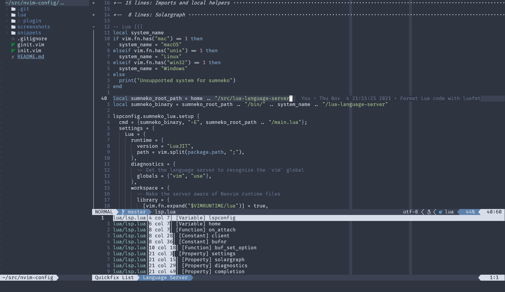

# Neovim config

A Neovim configuration with a focus on leveraging Neovim-specific features and its Lua API.

Some used plugins:

* [packer.nvim](https://github.com/wbthomason/packer.nvim): plugin management
* [nvim-tree.lua](https://github.com/kyazdani42/nvim-tree.lua): file explorer
* [galaxyline.nvim](https://github.com/glepnir/galaxyline.nvim): status line
* [NVim LSP](https://neovim.io/doc/user/lsp.html), [completion-nvim](https://github.com/nvim-lua/completion-nvim), [vim-vsnip](https://github.com/hrsh7th/vim-vsnip): LSP support and autocompletion
* [nvim-treesitter](https://github.com/nvim-treesitter/nvim-treesitter): better syntax highlighting
* [telescope.nvim](https://github.com/nvim-telescope/telescope.nvim): fuzzy finding

## Screenshots

Editing Lua with [NeovimTree](https://github.com/kyazdani42/nvim-tree.lua) open and a document symbols few provided by the language server. 

## Inspiration

* [Optixal's init.vim](https://github.com/Optixal/neovim-init.vim/)
* [Neovim LSP, DAP and Fuzzy Finder](https://medium.com/swlh/neovim-lsp-dap-and-fuzzy-finder-60337ef08060)
* [Neovim — init.lua](https://alpha2phi.medium.com/neovim-init-lua-e80f4f136030)
* [richin13's init.vim](https://github.com/richin13/dotfiles/blob/develop/dotfiles/.config/nvim/init.vim)
