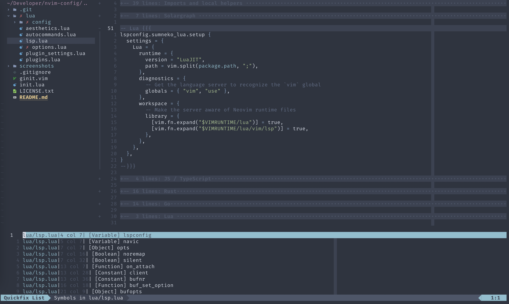

# Neovim config

This was originally based on [Optixal's Neovim init.vim](https://github.com/Optixal/neovim-init.vim/), but has diverged quite
a bit since then.

Editing with NerdTree and TagBar sidebars.



## Installing and Updating

### Install

#### Automated Installation

Run `./install.sh`

#### Manual Installation

```sh
# Make config directory for Neovim's init.vim
mkdir -p ~/.config/nvim

# Install nvim and its dependencies
brew install neovim
brew install --HEAD universal-ctags/universal-ctags/universal-ctags
pip install neovim

# Install vim-plug plugin manager
git clone https://github.com/k-takata/minpac.git ~/.config/nvim/pack/minpac/opt/minpac

# Install a nerd font for icons and a beautiful airline bar
brew cask install font-firacode-nerd-font

# Enter Neovim and install plugins using a temporary init.vim, which avoids
# warnings about missing colorschemes, functions, etc
sed '/command! PackStatus/q' init.vim > ~/.config/nvim/init.vim
nvim -c ':PackUpdate' -c ':UpdateRemotePlugins' -c ':qall'
rm ~/.config/nvim/init.vim

# Link init.vim in current working directory to nvim's config location ...
ln -s $PWD/init.vim ~/.config/nvim/
```
